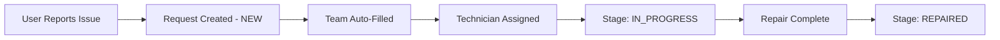
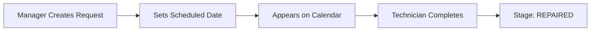

<p align="center">
  
</p>

<h1 align="center">GearGuard</h1>
<h3 align="center">The Ultimate Maintenance Tracker</h3>

<p align="center">
  <strong>A comprehensive maintenance management system for tracking assets and managing maintenance requests</strong>
</p>

<p align="center">
  
  
  
  
</p>

<p align="center">
  
  
  
  
</p>

---

## Table of Contents

- [Overview](#overview)
- [Features](#features)
- [Tech Stack](#tech-stack)
- [Getting Started](#getting-started)
- [Project Structure](#project-structure)
- [API Documentation](#api-documentation)
- [User Roles](#user-roles)
- [Workflows](#workflows)

---

## Overview

**GearGuard** is a full-stack maintenance management system designed to help organizations track their assets (machines, vehicles, computers) and manage maintenance requests efficiently.

<table>
  <tr>
    <td align="center"><br><strong>Equipment</strong><br>What needs maintenance</td>
    <td align="center"><br><strong>Teams</strong><br>Who performs maintenance</td>
    <td align="center"><br><strong>Requests</strong><br>The work to be done</td>
  </tr>
</table>

---

## Features

###  Equipment Management

| Feature | Description |
|---------|-------------|
| Asset Tracking | Name, serial number, category, location |
| Assignment | Department and employee ownership |
| Health Score | Track equipment condition (0-100%) |
| Warranty | Purchase date and warranty expiry tracking |
| QR Codes | Scannable codes for quick equipment lookup |
| Status | Active, Maintenance, Inactive states |

###  Team Management

| Feature | Description |
|---------|-------------|
| Specialized Teams | Create teams (Mechanics, Electricians, IT Support) |
| Team Members | Assign technicians to teams |
| Team Lead | Designate team leaders |
| Color Coding | Visual team identification |
| Performance | Track completed vs active requests |

###  Maintenance Requests

| Feature | Description |
|---------|-------------|
| Request Types | Corrective (breakdowns) & Preventive (routine) |
| Priority Levels | Low, Medium, High, Critical |
| Kanban Board | Drag-and-drop workflow management |
| Stage Tracking | New → In Progress → Repaired → Scrap |
| Auto-Fill | Equipment selection auto-fills team |
| Overdue Detection | Visual indicators for overdue requests |
| Scrap Logic | Auto-marks equipment inactive when scrapped |

###  Calendar View

| Feature | Description |
|---------|-------------|
| Visual Scheduling | See all scheduled maintenance on calendar |
| Click-to-Create | Create requests by clicking dates |
| Color-coded Events | Different colors for event types |

###  Reports & Analytics

| Feature | Description |
|---------|-------------|
| Dashboard Stats | Real-time metrics and KPIs |
| Equipment Reports | Health scores, status breakdown |
| Request Analytics | By type, priority, team |
| Export | PDF and Excel downloads |

###  Email Notifications

| Notification | When | Recipients |
|--------------|------|------------|
| Assignment Alert | Technician assigned to request | Assigned technician |
| Overdue Alert | Every hour (if overdue exists) | Admins & Managers |
| Daily Digest | 8:00 AM daily | Managers & Technicians |

###  Security & Access

| Feature | Description |
|---------|-------------|
| JWT Authentication | Secure token-based auth |
| Role-Based Access | Admin, Manager, Technician, User |
| Protected Routes | Role-specific page access |

###  Audit Logs

| Feature | Description |
|---------|-------------|
| Activity Tracking | All CRUD operations logged |
| User Attribution | Who made what changes |
| Timestamps | When changes occurred |

---

## Tech Stack

### Backend

<p>
  
  
  
  
  
</p>

| Technology | Purpose |
|------------|---------|
| Spring Data JPA | Database ORM |
| JWT | Token Authentication |
| ZXing | QR Code Generation |
| Apache POI | Excel Export |
| OpenPDF | PDF Generation |
| SpringDoc OpenAPI | API Documentation |

### Frontend

<p>
  
  
  
  
</p>

| Technology | Purpose |
|------------|---------|
| React Router | Navigation |
| Framer Motion | Animations |
| Lucide React | Icons |
| React Hot Toast | Notifications |
| @hello-pangea/dnd | Drag & Drop |
| FullCalendar | Calendar View |
| Chart.js | Data Visualization |

---

## Getting Started

### Prerequisites

<p>
  
  
  
  
</p>

### 1. Database Setup

```sql
CREATE DATABASE gearguard;
```

### 2. Backend Setup

```bash
cd gearguard-backend

# Configure database in application.properties
# Update: spring.datasource.url, username, password

# Run the application
mvn spring-boot:run
```

> Backend starts at: `http://localhost:8088`

### 3. Frontend Setup

```bash
cd gearguard-frontend

# Install dependencies
npm install

# Run development server
npm run dev
```

> Frontend starts at: `http://localhost:5173`

### 4. Initial Setup

1. Access `http://localhost:5173`
2. First user registration creates Admin account
3. Create departments, teams, and equipment
4. Add team members and start creating requests

---

## Project Structure

```
GearGuard/
│
├── gearguard-backend/
│   └── src/main/java/com/gearguard/
│       ├── config/          # Security, CORS, JWT
│       ├── controller/      # REST endpoints
│       ├── dto/             # Data Transfer Objects
│       ├── model/           # JPA Entities
│       ├── repository/      # Database access
│       └── service/         # Business logic
│
└── gearguard-frontend/
    └── src/
        ├── api/             # API clients
        ├── components/      # UI components
        ├── context/         # React Context
        └── pages/           # Page components
            ├── admin/
            ├── manager/
            ├── technician/
            ├── user/
            └── shared/
```

---

## API Documentation

<p>
  <a href="http://localhost:8088/swagger-ui.html">
    
  </a>
</p>

> Access Swagger UI at: `http://localhost:8088/swagger-ui.html`

### Key Endpoints

| Method | Endpoint | Description |
|--------|----------|-------------|
| `POST` | `/api/auth/login` | User login |
| `POST` | `/api/auth/register` | User registration |
| `GET` | `/api/equipment` | List all equipment |
| `POST` | `/api/equipment` | Create equipment |
| `GET` | `/api/teams` | List all teams |
| `GET` | `/api/requests` | List all requests |
| `PUT` | `/api/requests/{id}/stage` | Update request stage |
| `GET` | `/api/calendar` | Get calendar events |
| `GET` | `/api/qrcode/equipment/{id}` | Generate QR code |
| `GET` | `/api/audit-logs` | Get audit logs |

---

## User Roles

<table>
  <tr>
    <th>Role</th>
    <th>Icon</th>
    <th>Capabilities</th>
  </tr>
  <tr>
    <td><strong>Admin</strong></td>
    <td></td>
    <td>Full access - Users, departments, teams, equipment, requests, audit logs</td>
  </tr>
  <tr>
    <td><strong>Manager</strong></td>
    <td></td>
    <td>Manage teams, assign requests, view reports, create technicians/users</td>
  </tr>
  <tr>
    <td><strong>Technician</strong></td>
    <td></td>
    <td>View assigned requests, update status, record work duration</td>
  </tr>
  <tr>
    <td><strong>User</strong></td>
    <td></td>
    <td>Report equipment issues, track own request status</td>
  </tr>
</table>

---

## Workflows

### Flow 1: The Breakdown (Corrective)



### Flow 2: Routine Checkup (Preventive)



---

## UI Features

| Feature | Description |
|---------|-------------|
|  Dark/Light Mode | Toggle between themes |
|  Responsive | Works on desktop and mobile |
|  Real-time | Instant UI feedback |
|  Drag & Drop | Kanban request management |
|  Animations | Smooth Framer Motion transitions |
|  Notifications | Toast success/error feedback |

---

## Email Configuration

Configure SMTP in `application.properties`:

```properties
spring.mail.host=smtp.gmail.com
spring.mail.port=587
spring.mail.username=your-email@gmail.com
spring.mail.password=your-app-password
spring.mail.properties.mail.smtp.auth=true
spring.mail.properties.mail.smtp.starttls.enable=true
```

---

## Contributing

1. Fork the repository
2. Create feature branch (`git checkout -b feature/AmazingFeature`)
3. Commit changes (`git commit -m 'Add AmazingFeature'`)
4. Push to branch (`git push origin feature/AmazingFeature`)
5. Open a Pull Request

---

## License

This project is licensed under the MIT License.

---

<p align="center">
  
  
</p>